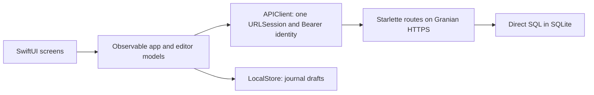

# Collaborator entry point

This build supplies read/write foundations for all three tabs: text Journal, life Notes and Settings/profile. The interface is native SwiftUI; the API is plain authenticated JSON over HTTPS. It currently makes no AI calls.

## File map

| Feature | Screen and state | API / backend | Storage |
| --- | --- | --- | --- |
| Journal | `JournalView`, `JournalModel`, `DreamEditor`, `DreamModel` | `/v1/dreams`, `dreams.py` | `dreams`; unsent drafts in phone SQLite |
| Notes | `NotesView`, `NoteEditorView`, `NotesModel`, `NoteEditorModel` | `/v1/memories`, `memories.py`, `photos.py` | `memories`, `memory_photos`; unsent editor state in memory |
| Profile | `ProfileSettings`, `ProfileModel` | `/v1/me/profile`, `profiles.py` | `profiles.fields_json` |
| Settings and deletion | `Settings`, `AppModel` | `/v1/me`, `records.py` | `users`; delete cascades profiles, notes and journals |
| Shared infrastructure | `Identity`, `APIClient`, `PrivacyNotice`, `LocalStore` | `main.py`, `web.py`, `db.py`, `config.py` | Device-only Keychain, database schema |

All Swift files above are in `ios/DreamLog/`; backend files are in `backend/`. Routes are listed in `backend/main.py`. Read [API.md](API.md) for callable contracts and [LocalDevelopment.md](LocalDevelopment.md) to run them.

## How to extend

- A normal profile field: add one `ProfileField` to `profileFields` in `ProfileSettings.swift`. Keys and values already round-trip through the dictionary API and SQLite JSON. Users can add or remove fields in Settings too. Add special backend validation in `profiles.py` only when the new field needs it; age already has a numeric rule. All values are strings.
- A new feature: put its route functions and SQL in one backend module, register routes in `main.py`, add the corresponding JSON value types/APIClient methods and a SwiftUI screen with an observable state model. Follow an existing feature rather than introducing a service/ORM/repository layer.
- New persistence: change `schema.sql`, increment `SCHEMA_VERSION` and add an explicit, tested upgrade path in `db.py`. Backend version 3 adds note photos to versions 1/2 without replacing data; the phone draft schema remains version 1.
- Privacy text: edit `privacyParts` and increase `noticeVersion` in `PrivacyNotice.swift`. First launch and Settings read the same six short parts. The user requested provisional, brief copy; this supersedes the wiki's full copy for this development build. The acknowledgment gate remains active.
- Cloud: configure the HTTPS origin, TLS and data directory. The mobile app continues calling the same API. Managed database/release differences belong in [ProductionTransition.md](ProductionTransition.md).

## Rules that collaborators should preserve

The Bearer UUID determines the owner. Never accept a request body owner as authorization. A note/journal ID owned by another user returns 404. Omitted update fields retain their stored values where the API documents a partial update. Revisions prevent stale content from overwriting a newer version. Repeated unchanged saves keep their IDs and revisions. Save failure keeps editor input; delete failure keeps visible records.

Settings profile edits use a separate endpoint so automatic timezone/history updates cannot erase personal fields. Profile data is not fed into AI. All requests use APIClient's privacy gate and shared cancelable session. Whole-journal deletion also deletes Notes and Profile.

## Scope boundary

This is the user's requested CRUD foundation, not a full Increment 5/AI pipeline. Notes follow the wiki's memory representation, ownership, dates and revisions; there is no worker, AI dependency invalidation, context selection or check-in behavior yet. Later AI collaborators must add those effects before scheduling AI tasks, including dependencies affected by note changes/deletion. Profile fields are an explicit addition to the wiki design.

Journal now commits automatically on leaving the editor and offers Revert instead of Save. Notes also supports photo attachments. [EditorAndPhotos.md](EditorAndPhotos.md) records the interaction rules, storage choice, callable photo API and explicit `AI integration point` comments in the code.

Short privacy copy is provisional development content. Detailed provider, recording and project-end policies must be restored before those features or a release. Voice, analysis, discussion and media remain future work. No remote deployment or App Store submission is claimed.
