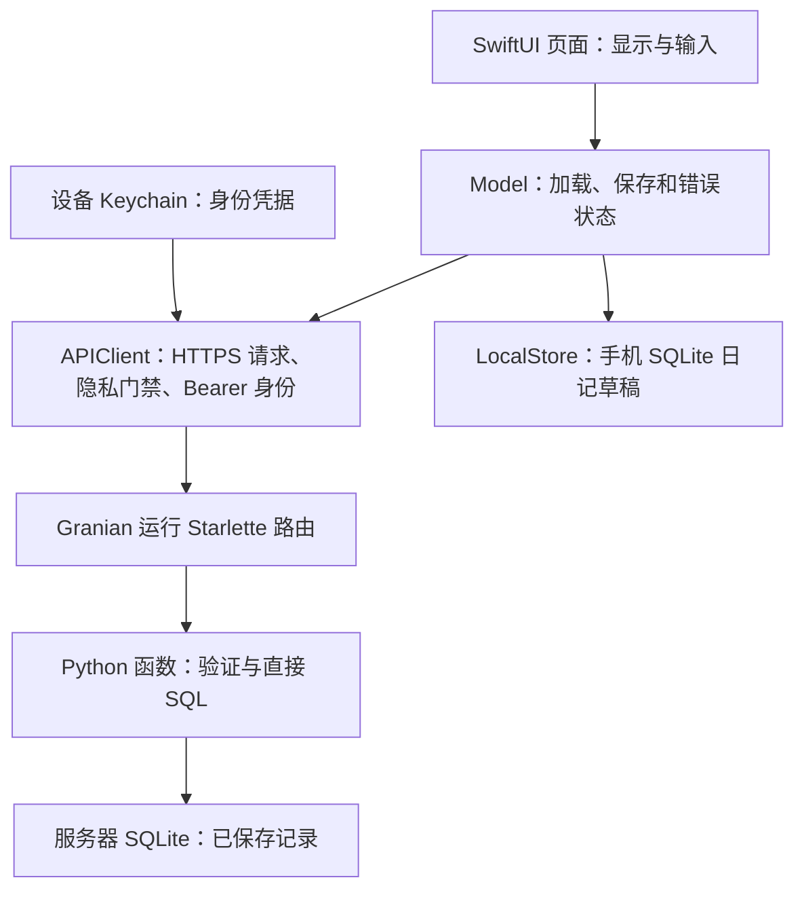
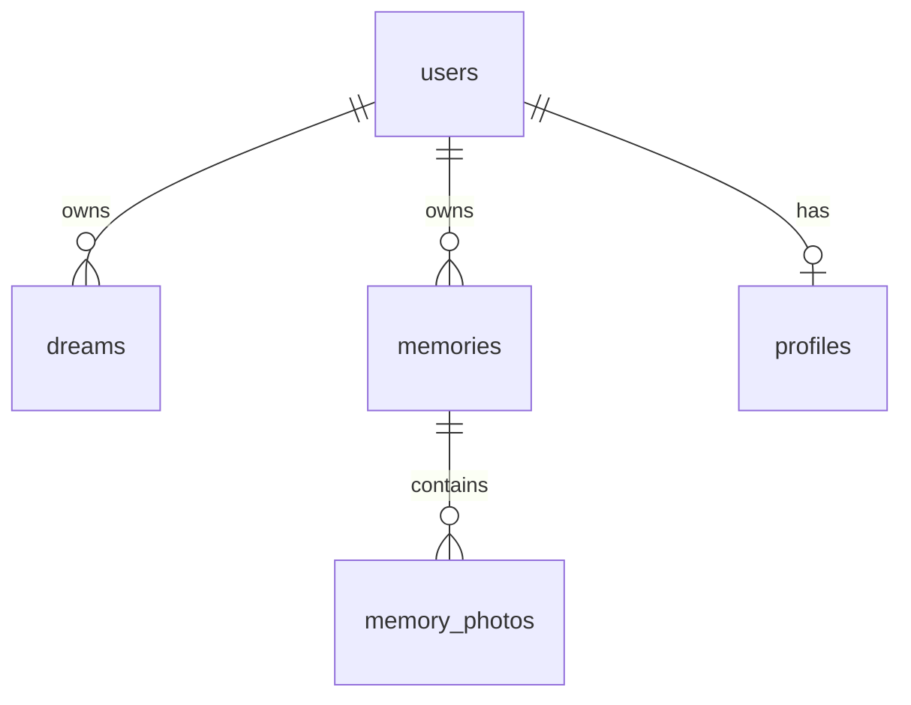

# DreamLog 中文新手指南：Swift、数据库与增量开发

本文面向刚开始学习 Swift 和数据库的项目成员，按“看懂数据 → 看懂代码 → 调用现有接口 → 增加功能”的顺序阅读。示例使用虚构内容。

**阅读前提：**以下“当前实现”指本仓库 2026-10-09 的代码，不代表已经部署到云端。wiki 描述产品总体设计；[Architecture.md](Architecture.md)、[API.md](API.md) 和实际代码说明当前可用能力。开发约束见最新的 [CLAUDE.md](../CLAUDE.md)；工作区上级还有 [AGENTS.md](../../AGENTS.md)。本文只补充教程，不修改这些约束或产品设计。

## 1. 先认识这个项目

DreamLog 是一个原生 iOS 日记应用。手机负责显示页面、接收输入和保存未提交的日记草稿；Python 后端负责验证请求、判断数据归属、读写服务器数据库。

目前可以使用：

- Journal：文字日记的新增、列表、读取、修改、删除和文字搜索。
- Notes：生活笔记的增删改查，以及每条最多五张照片。
- Settings：个人资料、历史开关、隐私说明和删除整个日记库。
- 公共基础：Keychain 身份、隐私确认门禁、HTTPS API、SQLite。

语音转写、AI 整理、分析、讨论、每周 check-in、语义搜索和生成图片/视频仍是后续功能。数据库里出现 `tasks` 或 `outputs` 表，不等于已有可调用的 AI 接口。当前保存文字不会安排 AI 任务。



**手机没有直接连接服务器 SQLite。**它只能向后端发请求，后端决定可以读写哪些记录。更换服务器地址不会让手机变成数据库客户端。

## 2. 数据库最基础的概念

### 2.1 表、行、列和类型

可以先把一张表想成有规则的电子表格：表保存同一类数据，行是一条记录，列是记录的一个属性。数据库还会检查规则、关联记录和执行查询。

例如 `dreams` 表的一小部分：

| id | user_id | text | revision | dream_date |
| --- | --- | --- | --- | --- |
| 日记 A 的 UUID | 手机甲的 UUID | 我梦见一片湖 | 1 | 2026-10-09 |
| 日记 B 的 UUID | 手机乙的 UUID | 我梦见一座山 | 3 | 2026-10-08 |

这里 UUID 是随机生成的标识符；日记 ID 与用户 ID 是两种不同用途的 ID。

| SQL 类型/规则 | 含义 | 本项目例子 |
| --- | --- | --- |
| `TEXT` | 字符串 | 日记正文、UUID、日期字符串 |
| `INTEGER` | 整数 | 版本号、毫秒时间戳、用 0/1 保存的布尔值 |
| `BLOB` | 二进制数据 | Notes 照片原始字节 |
| `NULL` | 没有值 | 没有标题、没有事件日期 |
| `NOT NULL` | 不能没有值 | 日记的 `user_id` |
| `DEFAULT` | 插入时未提供该列的默认值 | `use_history` 默认 1 |
| `CHECK` | 数据必须满足条件 | mood 必须属于允许的值 |

`NULL`、空字符串 `""` 和数字 `0` 不是一回事。查询“没有标题”用 `title IS NULL`，不能用 `title = NULL`。

### 2.2 主键、外键与数据归属

**主键（PRIMARY KEY）**唯一标识一行。`dreams.id` 是日记主键，修改正文不应换一个主键。

**外键（FOREIGN KEY）**把两张表关联起来。例如：

```sql
user_id TEXT NOT NULL REFERENCES users(id) ON DELETE CASCADE
```

含义是这条日记属于 `users` 中存在的用户；删除该用户时，相关日记随之删除。`memory_photos.memory_id` 则关联到生活笔记。

外键保证“引用的用户存在”，**不会自动判断发请求的人是不是这个用户**。后端仍然必须根据 Bearer 凭据筛选所有者。



### 2.3 CRUD 和最常见的 SQL

CRUD 是四个操作的缩写：Create 新增、Read 读取、Update 修改、Delete 删除。

下面是后端代码中使用的参数化查询形式：

```python
rows = await db.rwdb.execute_fetchall(
    "SELECT id,text,revision FROM dreams WHERE id=? AND user_id=?",
    (dream_id, identity),
)
```

`SELECT` 选择列，`FROM` 指定表，`WHERE` 限制符合条件的行。`?` 由后面的参数填入。不要把用户输入通过字符串拼接写进 SQL；参数会把正文中的引号当数据处理。

另外三个操作的形状是：

```sql
INSERT INTO ... (...) VALUES (...);
UPDATE ... SET ... WHERE ...;
DELETE FROM ... WHERE ...;
```

这是语法示意，不是让你直接操作项目数据库。开发功能应经过已有后端函数，保留所有者检查和版本检查。尤其注意 `UPDATE` 和 `DELETE` 的 `WHERE`：它决定受影响的记录范围。

### 2.4 事务、原子更新和索引

**事务（transaction）**让一组相关数据库操作作为整体提交；失败时回滚。例如“读取当前版本 → 检查版本 → 写入新内容”应放在同一个事务中。本项目使用 `async with db.tx() as connection:`；由 `db.py` 管理锁和提交。事务里不应等待 AI 或图片下载等外部请求，否则会长时间占用写入机会。SQLite 同一时间只允许一个写事务。[SQLite 事务说明](https://www.sqlite.org/lang_transaction.html)

**Upsert**表示不存在就插入，存在就更新。项目使用：

```sql
INSERT INTO ... VALUES (...)
ON CONFLICT(...) DO UPDATE SET ...;
```

这避免用“删除旧行再插入新行”更新记录；后者可能触发级联删除，丢掉关联数据。Upsert 仍需所有者与版本检查，不能代替它们。

**索引（index）**相当于按特定列组织的查找目录。`dreams(user_id,dream_date,created_at)` 有助于按用户读取日记列表。索引占空间，也增加写入成本；新增查询时根据实际筛选和排序考虑索引，不必给每列建索引。

### 2.5 schema、迁移和 revision 是三件事

| 名称 | 管什么 | 当前项目 |
| --- | --- | --- |
| schema（数据库结构） | 有哪些表、列、约束和索引 | `backend/schema.sql` |
| schema version（结构版本） | 数据库结构升级到了第几版 | 后端 `SCHEMA_VERSION = 3`；手机草稿库为 1 |
| revision（记录版本） | 某条记录的内容更新到了第几版 | 日记、笔记、个人资料各自的 revision |

**迁移（migration）**是在保留已有数据的前提下升级结构。修改 `CREATE TABLE IF NOT EXISTS` 不会给已有表自动加列；新增列需要显式升级，例如 `ALTER TABLE ... ADD COLUMN ...`。不能把删除数据库文件当升级步骤。[SQLite ALTER TABLE](https://www.sqlite.org/lang_altertable.html)

记录版本用于避免旧编辑覆盖新内容。例如你打开 revision 2，其他请求把正文改到 revision 3；你还拿 `base_revision: 2` 提交不同正文，服务器返回 409，让你重新加载并决定如何合并。

本项目的 revision 并不保护所有字段：日记只有正文变化才递增；笔记正文、日期、精度、ongoing 变化才递增；个人资料字典变化才递增。相同内容重试不递增。新增字段前要先决定它属于哪种更新规则。

### 2.6 数据实际存在哪里

| 数据 | 位置 | 生命周期 |
| --- | --- | --- |
| 已保存日记、笔记、设置、资料 | 服务器 SQLite | 后端管理，删除整个日记库时清除 |
| 未提交 Journal 草稿 | 手机 `LocalStore` 的 SQLite | 输入时保存，服务端确认成功后清除对应草稿 |
| 未提交 Notes 文字和待上传照片 | 当前编辑器内存 | 当前没有持久化草稿，不能假定重启后还在 |
| 已上传 Notes 照片 | 服务器 `memory_photos.content` BLOB | 随所属笔记或用户删除 |
| 用户身份 UUID | 设备 Keychain | 不经 iCloud 同步，不显示在 UI 中 |
| 隐私确认版本等小设置 | UserDefaults | 删除流程清理相关键 |

草稿保存成功只表示手机保存了输入；服务器返回成功才表示网络提交完成。

## 3. 读懂项目所需的 Swift 基础

### 3.1 变量、类型、集合和函数

```swift
let entryID = UUID().uuidString.lowercased()
var text: String = "我梦见一片湖"
var revision: Int = 0
var isSaving: Bool = false
var title: String? = nil
let moods: [String] = ["calm", "happy"]
var fields: [String: String] = ["city": "Ann Arbor"]

func trimmed(_ value: String) -> String {
    value.trimmingCharacters(in: .whitespacesAndNewlines)
}
```

- `let` 的值不能重新赋值，`var` 可以；优先把不变的值写成 `let`。
- `String` 是文字，`Int` 是整数，`Bool` 是 true/false。
- `[String]` 是字符串数组；`[String: String]` 是键和值都为字符串的字典。
- `func` 定义函数，`-> String` 表示返回字符串，`_` 表示调用时省略该参数标签：`trimmed(text)`。
- Swift 能推断很多类型，因此 `let revision = 0` 也可以。

`let` 不等于“对象内部永远不变”：如果它引用的是 class，是否能修改对象属性还取决于属性与隔离规则。

### 3.2 Optional：有值或没有值

`String?` 表示可能有字符串，也可能是 `nil`。不要用 `!` 强制假定一定有值。

```swift
let displayedTitle = title ?? "Untitled"

if let title {
    print(title)
}
```

`??` 提供默认值；`if let` 只在有值时进入代码块。项目中还常见：

```swift
guard let client = app.client else { return }
```

`guard` 的含义是“后续步骤需要这个前提，不满足就提前退出”。这让正常流程不必层层缩进。

### 3.3 struct、class、enum 与协议

- `struct` 是值类型，通常用于一条记录或请求的数据。赋值后按值语义使用。
- `class` 是引用类型，可以让页面共享同一个状态对象，例如 `AppModel`。
- `enum` 表示有限的选择，例如 mood 或成功/失败，避免到处比较任意字符串。
- 协议说明类型具备什么能力。例如 `Identifiable` 提供稳定的 `id`，便于 SwiftUI 识别列表记录。

项目中的 `Dream` 是一个 struct，`DreamModel` 是管理编辑状态的 class。它们名字相近，但职责不同：前者描述数据，后者管理加载、编辑、提交和错误。

### 3.4 Codable：Swift 与 JSON 之间的转换

API 通过 JSON 交换数据，JSON 不是数据库表。`Encodable` 让 Swift 值变成 JSON，`Decodable` 把 JSON 变成 Swift 值，`Codable` 同时具备两者。

项目常用的对应关系：

| Swift | JSON | SQLite |
| --- | --- | --- |
| `dreamDate: String` | `"dream_date": "2026-10-09"` | `dream_date TEXT` |
| `useHistory: Bool` | `"use_history": true` | `use_history INTEGER`（0/1） |
| `updatedAt: Date` | `"updated_at": 1791500000000` | 毫秒时间戳 INTEGER |

`APIClient` 解码时使用 `.convertFromSnakeCase` 和 `.millisecondsSince1970`。编码不是所有方法都自动转 snake_case：有的请求类型用 `CodingKeys`，有的调用点设置 `.convertToSnakeCase`。新增字段要检查该请求实际使用的 encoder。

`nil` 也不必然编码成 JSON `null`；自动生成的可选字段编码可能省略键。如果接口要求“省略表示保留，null 表示清除”，必须沿用现有请求类型的显式编码方式。

### 3.5 SwiftUI、状态和 Binding

SwiftUI 的基本写法是“根据当前状态描述界面”。`body` 返回页面结构，状态变化后 SwiftUI 更新显示。不要在 `body` 中直接发请求，因为它可能被反复求值。

```swift
import SwiftUI

struct BeginnerTextView: View {
    @State private var text = ""

    var body: some View {
        VStack {
            TextField("Dream", text: $text)
            Text(text.isEmpty ? "还没有输入" : text)
        }
    }
}
```

这是独立语法练习，不是项目的新页面。`some View` 表示返回一种遵循 View 协议的具体类型，由编译器推断。

`@State` 保存页面拥有的状态；`$text` 提供 Binding，让输入框能读取并修改这个状态。它不会自动保存到数据库。

| 项目中的写法 | 作用 |
| --- | --- |
| `@Observable` | 让共享 Model 的属性变化可被界面观察 |
| `@State private var model = ...` | 页面拥有并保持自己的 Model |
| `@Environment(AppModel.self)` | 从上层环境获取共享 AppModel |
| `@Bindable` / `Binding(get:set:)` | 为可观察状态或自定义读写逻辑提供双向绑定 |
| `.task { ... }` | 在视图生命周期中执行异步工作；可能重新运行，需要加载保护 |

这些概念对应 Apple 的 [SwiftUI 数据管理说明](https://developer.apple.com/documentation/swiftui/managing-model-data-in-your-app)。本项目采用 Observation，新增功能继续沿用现有方式。

### 3.6 async、await、Task、actor 与 Result

`async` 表示函数可以暂停等待；`await` 表示这里等待异步结果，让执行器有机会处理其他工作。它不保证启动一个新线程，也不保证所有工作在后台运行。

项目通常这样处理一次读取：

```swift
let result = await client.loadDream(entryID)
switch result {
case let .success(dream):
    print(dream.revision)
case let .failure(error):
    print(error.message)
}
```

这是异步上下文中的片段；实际功能应把结果写入 Model，避免输出用户正文或身份凭据。`Result<Dream, APIError>` 表示成功带回 Dream，失败带回 APIError；错误必须成为可处理的状态。

`Button { Task { await model.save(app) } }` 中的 `Task` 让同步按钮动作发起异步工作。`{ ... }` 是闭包，也就是传给另一个函数的一段可执行代码；不要把 Task 当成不受管理的永久后台线程。

`@MainActor` 用于隔离 UI Model 的可变状态；它不表示可以在其中做耗时的同步图片处理。`actor LocalStore` 隔离本地数据库的可变状态，从外部访问通常要 `await`。actor 在 `await` 时可以让其他工作进入，所以等待后仍要检查当前操作是否有效。

你还会看到 `Sendable` 和 `nonisolated`：前者描述值能否安全跨隔离域传递，后者声明不受某个 actor 隔离的声明。保持现有类型的隔离方式；不要靠删除这些标记或加 `@unchecked Sendable` 消除编译器提示。

## 4. 用“保存一篇日记”串起架构

1. `DreamLogApp` / `RootView` 启动共享 `AppModel`，先确定身份和隐私确认状态。
2. `Identity` 从设备 Keychain 读取身份；不存在才创建随机小写 UUID，读取失败则停止，不创建临时身份。
3. 首次启动先显示隐私说明。确认前不能进入主页面或发送普通 API 请求；曾确认旧说明的用户可通过说明页删除原日记库。
4. 确认后 `AppModel.load()` 调用 `GET /v1/me`。每次启动至多进行一次自动 `PUT /v1/me` 对齐，保留服务器返回的历史开关。当前提醒字段发送 null，完整提醒功能尚未实现。
5. Journal 新建记录时先生成固定日记 ID。`DreamModel` 把输入存成 `Draft`，通过 `LocalStore` 写入手机 SQLite。
6. 用户离开编辑器或应用进入后台时尝试提交；输入每个字符不会都发网络请求。只读取草稿不会提交。
7. `APIClient.saveDream` 发送带 Bearer 的 `PUT /v1/dreams/{id}`。
8. `main.py` 将请求分派给 `dreams.py`；`resolve_user` 验证身份，保存函数验证字段、所有权和 revision，在事务中写 SQLite。
9. 后端返回保存后的 Dream。Model 使用服务器结果更新状态，清除已确认的本地草稿；失败则保留输入并显示错误。

若请求发出后没收到响应，不能确定服务器是否已保存。现有日记逻辑会先读取同一个 ID 对账，再决定重试；新增功能不要一遇到超时就生成新 ID。

`Revert` 放弃当前编辑，不是撤销已经提交并重新打开的历史版本。Notes 的交互不同：保留 Save；Done 提供 Save and close、Discard、Keep editing。文字与每张照片分别保存，照片失败不会撤回已经保存的文字。

## 5. 你现在可以调用哪些接口

本地地址为 `https://127.0.0.1:8443`。每个业务请求都携带：

```http
Authorization: Bearer <小写 UUID>
```

有效的新 UUID 会由 `resolve_user` 建立对应用户。它是这个原型的身份凭据，没有传统账号登录；不同 UUID 的数据与设置相互独立。不要在 UI、日志或提交到仓库的文件中暴露真实凭据。

| 功能 | HTTP 接口 | Swift 调用位置/方法 |
| --- | --- | --- |
| 读取与修改设备设置 | `GET /v1/me`、`PUT /v1/me` | `loadMe`、`saveMe`；UI 通过 AppModel 更新 |
| 删除整个日记库 | `DELETE /v1/me` | UI 必须使用 `AppModel.deleteJournal()` 完整流程 |
| 日记列表 | `GET /v1/dreams` | `loadJournal` |
| 日记搜索 | `POST /v1/dreams/search` | 带筛选条件的 `loadJournal` |
| 单篇日记读写删除 | `GET/PUT/DELETE /v1/dreams/{id}` | `loadDream`、`saveDream`、`deleteDream` |
| Notes 列表 | `GET /v1/memories` | `loadMemories` |
| 单条 Notes 读写删除 | `GET/PUT/DELETE /v1/memories/{id}` | `loadMemory`、`saveMemory`、`deleteMemory` |
| Notes 照片读写删除 | `GET/PUT/DELETE /v1/memories/{id}/photos/{photo_id}` | `loadNotePhoto`、`saveNotePhoto`、`deleteNotePhoto` |
| 个人资料读写 | `GET/PUT /v1/me/profile` | `loadProfile`、`saveProfile` |

列表支持 `limit`（1–200，默认 50）和 `offset`，返回 `items` 与 `has_more`。部分 Swift 方法目前只暴露 offset；需要其他参数时扩展已有方法。Notes 后端另支持 `ongoing=true/false`。搜索现在是 SQLite 标题/正文文字匹配，不是 AI 语义搜索。

### 5.1 创建、修改与重试

创建日记的请求体：

```json
{
  "base_revision": 0,
  "text": "我梦见一片湖",
  "dream_date": "2026-10-09",
  "title": "湖边",
  "mood": "calm",
  "source": "text"
}
```

新建时 `base_revision` 为 0。成功后保存服务器返回的 revision；修改时使用它。新建返回 201，更新或相同内容重试返回 200，数据包在 `{"dream": {...}}` 中。重试使用同一个日记 ID。

Notes 的请求体是另一种类型，不要直接复用日记请求：

```json
{
  "base_revision": 0,
  "text": "最近在准备考试",
  "event_date": null,
  "event_precision": "unknown",
  "is_ongoing": false,
  "allow_analysis": true
}
```

Notes 无日期时使用 null + unknown；有日期时精度为 exact 或 approximate。返回包为 `memory`。正文可为空以支持照片笔记，纯空白文字不接受。先保存笔记，再上传照片原始字节；照片请求不是 JSON。

详细字段、长度限制与权限行为以 [API.md](API.md) 为准。尤其注意：笔记过期的内容修改返回 409 时，明确提交的分析权限仍可能已保存，不能把 409 理解为整个请求毫无影响。

### 5.2 PUT 不总是“全部覆盖”

| 接口 | 省略字段的意义 | 如何清除 |
| --- | --- | --- |
| `/v1/me` | 已文档化的可选字段保留原值 | 提醒设为 null；history 必须是布尔值 |
| 日记更新的 title/mood | 保留原值 | 显式 null |
| Notes 更新的可选字段 | 保留原值 | 移除日期同时发送 null + unknown |
| `/v1/me/profile` 的 fields 字典 | 整个字典替换；省略的键被移除 | 移除键、使用空值，或 `fields: {}` 清空 |

个人资料增加 city 时，应读取并保留现有字典，再加入 city 后提交。只发 `{"city":"..."}` 会删除其他资料字段。HTTP 方法相同，不代表业务语义相同。

### 5.3 错误与删除

| 状态码 | 含义 | 客户端动作 |
| --- | --- | --- |
| 400 | 字段类型、日期或值不合法 | 修正输入 |
| 401 | Bearer 缺失或不合法 | 检查身份读取/发送流程，不换临时 ID |
| 404 | 不存在或不属于该用户 | 不显示其他用户数据；保留未提交编辑 |
| 409 | 内容版本冲突 | 保留输入，读取最新版本后决定合并 |
| 413 | 大小或长度超限 | 缩小输入/照片 |
| 500 | 服务器内部失败 | 显示可重试错误，注意提交结果可能不确定 |

错误体含 `error`、`message`、`request_id`、`current_revision`；版本冲突带当前版本。成功删除返回 204，没有 JSON 正文。

“删除整个日记库”还包括 Notes 和 Profile。AppModel 会取消请求、删除服务器数据，然后清理本地数据库、缓存、相关 defaults、通知和 Keychain，回到首次隐私说明并创建新身份。页面只调用 `client.deleteMe()` 会漏掉手机清理。旧编辑器等待中的结果也必须被拒绝，项目用 `journalEpoch` 检查这一点。

## 6. 增量开发：先决定要不要新增接口

每次只实现一个能从 UI 走到持久化再读回的完整小功能。

| 想加的功能 | 最小改动方向 |
| --- | --- |
| 改显示文案、布局 | SwiftUI 页面 |
| 增加普通资料字段 | 已有资料字典与 UI；通常无需新表或新接口 |
| 使用已有日记筛选 | 现有 filter / APIClient / 页面 |
| 为现有记录增加持久化属性 | schema 迁移 + 现有接口 + Swift 类型与状态 |
| 新增独立资源或独立工作流 | 按 wiki 设计新增表/路由和对应客户端 |
| 增加 AI 分析 | 先完成 wiki 的任务、权限、来源版本、失效与删除规则 |

保留当前的短链路：页面 → Model → APIClient → 路由函数 → SQL。这个原型不需要为了一个字段引入通用 Service、Repository、ORM 或依赖注入框架。

### 6.1 第一个练习：新增 hometown 资料字段

在 `ios/DreamLog/ProfileSettings.swift` 的 `profileFields` 数组中增加：

```swift
.init(key: "hometown", title: "Hometown")
```

它复用 `[String: String]`、`ProfileSave`、`PUT /v1/me/profile` 和 `profiles.fields_json`，无需 schema 迁移或新接口。普通字段值都是字符串，最多 200 字符；键符合 `[a-z][a-z0-9_]{0,39}`，最多 30 个字段。若字段需要特殊规则，才在 `profiles.py` 增加相应验证。

新资料默认显示已声明的字段；已有资料的实际可见键来自保存的字典，不能假定新增数组元素会立即显示到所有旧资料中。旧用户可通过 Add field 加入 hometown。验证保存、重新读取和移除即可；资料目前不进入 AI 输入。

### 6.2 第二个练习：给日记增加“收藏”属性

**这是设计练习，当前没有日记收藏字段或接口。**`favorite_visual_id` 是未来视觉版本相关字段，不能当作日记是否收藏。

先明确不变量：收藏是某用户拥有的日记属性；旧数据默认不收藏；重试不产生新日记；收藏变化不应被算成正文变化。

建议复用现有日记读写接口，按下面顺序实现：

1. 在最新 schema 中加入 `is_favorite INTEGER NOT NULL DEFAULT 0 CHECK(is_favorite IN (0,1))`。
2. 提升后端结构版本，在 `db.py` 增加旧库的显式加列迁移；兼容现有版本 1/2/3 到新版本，且再次启动不能重复加列。不能只改版本常量：当前迁移逻辑只接受特定旧版本，需要一起更新。
3. 在 `dreams.py` 的请求类型、验证、SQL 和详情/列表返回中加入字段。编辑时省略就保留；显式 bool 才修改；继续要求日记 ID 与 Bearer 用户匹配。
4. 明确是否沿用日记的正文 revision 规则。若收藏不递增正文 revision，应记录这一点；是否允许独立修改也要定义。当前 PUT 必需正文和日期，不能直接只发送收藏字段。
5. 在 Swift 的 Dream、JournalItem、DreamSave、Draft 中同步属性，检查编码、解码、草稿比较和保存对账。新字段若进入本地草稿，还要升级手机的 `LocalStore` schema；后端迁移不会改变手机库。
6. 在页面与 Model 增加动作、忙碌保护和失败反馈；显示服务器返回值。
7. 验证旧库升级、默认值、持久化、重复保存、不同用户隔离和失败保留状态，更新 API 文档。

若以后要“只改收藏，不带正文”，再定义一个明确的局部更新契约；不要偷偷改变现有 PUT 的必需字段语义。

### 6.3 新增接口应该遵循的规范

**先写契约，再写实现。**契约至少回答：谁能调用、路径与方法、请求字段、省略/null 的区别、响应形状、状态码、版本检查、重复调用效果，以及删除时怎么清理。

- 路径保持 `/v1/...` 风格，以资源命名；带 ID 的创建/保存沿用客户端生成 ID、PUT 和稳定重试规则。搜索正文含私人信息时，沿用 POST 请求体方式。
- 后端先用 `resolve_user(request)` 获取身份，路径 ID 用 `check_id` 验证；请求 body 的 `user_id` 不提供权限。
- 所有读写都限定所有者，包括关联资源。不能仅凭照片 ID 或日记 ID 查出数据就返回；其他用户的记录按现有规则返回 404。
- JSON 请求使用 `read_body` 与 msgspec 类型验证，响应使用 `json_response`，业务错误使用 `RequestError`。不要返回包含正文或凭据的异常栈。
- 数据库采用参数化 SQL；相关读写放入 `db.tx()`。更新保留主键与关联，使用已有 UPDATE/upsert 方式。
- 文档明确什么变化递增 revision、什么时候冲突、相同重试返回什么。新功能不要笼统套用“所有 PUT 都覆盖全部字段”。
- 客户端新增方法放在 APIClient，复用其私有请求方法，不另建 URLSession 绕过隐私门禁、身份或取消机制。
- Model 负责加载/提交/错误状态，View 负责界面。等待返回后检查 `journalEpoch` 和删除状态，避免旧结果写回新日记库。
- 保存失败保留用户输入；删除失败保留可见记录。UI 使用服务器返回值，不把乐观本地值当成已保存事实。
- 新数据要纳入单条资源删除及 `DELETE /v1/me`。外键级联只处理数据库关系；文件和没有相应外键的记录仍要显式清理。
- AI 密钥与 provider 调用放后端。权限关掉后不能继续发新请求；已有输出的来源版本、失效和删除效果应按 wiki 一起实现。

### 6.4 一次功能开发的文件地图

| 要修改的内容 | 先找这些文件 |
| --- | --- |
| 日记页面与编辑状态 | `JournalView.swift`、`DreamEditor.swift`、`JournalModel.swift`、`DreamModel.swift` |
| 日记 JSON 数据类型 | `JournalModels.swift` |
| Notes 页面与类型 | `NotesView.swift`、`NoteModels.swift` |
| 资料页面与类型 | `ProfileSettings.swift` |
| 设置、启动、删除与隐私 | `Settings.swift`、`AppModel.swift`、`PrivacyNotice.swift`、`RootView.swift` |
| 身份与网络 | `Identity.swift`、`APIClient.swift` |
| 手机草稿 | `LocalStore.swift` |
| 路由注册 | `backend/main.py` |
| 日记/笔记/资料/照片业务 | `backend/dreams.py`、`memories.py`、`profiles.py`、`photos.py` |
| 设备设置与整库删除 | `backend/records.py` |
| 共享验证、SQL 连接与结构 | `backend/web.py`、`db.py`、`schema.sql`、`config.py` |

所有 Swift 文件位于 `ios/DreamLog/`。优先读当前功能文件，遇到直接依赖再追踪；不必先读完整四千行 wiki 才能做资料字段练习。改变架构决定时仍应先更新 wiki 总体设计并同步实现文档。

## 7. 本地运行与验证

以下命令从代码仓库 `ShuttleCode` 根目录开始；完整要求见 [LocalDevelopment.md](LocalDevelopment.md)。Python 环境由 uv 管理，当前项目要求 Python 3.14；iOS 部署目标为 26，Swift 语言模式为 6。语言模式不是编译器版本。

启动后端并保持终端运行：

```sh
./scripts/run-local.sh
```

打开 `ios/DreamLog.xcodeproj`，启动一个 iOS 26+ 模拟器，然后在另一个终端为该模拟器信任证书：

```sh
DEVELOPER_DIR=/Applications/Xcode.app/Contents/Developer xcrun simctl keychain booted add-root-cert backend/.local/server.crt
```

再运行 App。Xcode 不会替你启动后端。真机上的 `127.0.0.1` 指真机自己，应按本地开发文档配置 Mac 的局域网地址及包含对应地址的受信任证书，不能靠关闭 HTTPS 验证解决。

改动后端后，在另一个终端运行相关测试：

```sh
cd backend
uv run --locked pytest -q
```

后端正在运行时，可用真实 HTTPS 测试验证跨层调用：

```sh
uv run --locked python tests/smoke_https.py
```

测试使用虚构数据。Swift 改动用 Xcode 的 Product → Test 验证对应 Model/接口行为；UI 文案等低影响改动通常编译和手动检查即可。数据库结构或授权改变应添加有实际意义的迁移、隔离与失败测试。

最后静态检查：每个请求是否经过隐私门禁？每个 SQL 是否限定所有者？失败是否保留输入？重试是否复用 ID？旧库是否保留数据？整库删除是否覆盖新增数据？记录本次实际运行的验证，不把 [Verification.md](Verification.md) 的历史结果当成自己刚跑过的结果。

部署目标是 Ubuntu 上的 Granian/Starlette HTTPS 与 SQLite，后续配置步骤见 [ProductionTransition.md](ProductionTransition.md)。本地通过测试不等于已完成线上部署。

## 8. 推荐阅读顺序

1. 本文第 1–4 节：理解页面、状态、请求和数据库的关系。
2. `ProfileSettings.swift` 与 `backend/profiles.py`：最短的一条完整读写链路。
3. [API.md](API.md)：确认字段、版本和错误规则。
4. `DreamModel.swift`、`APIClient.swift` 与 `backend/dreams.py`：理解草稿、冲突与不确定提交。
5. [EditorAndPhotos.md](EditorAndPhotos.md)：理解附件部分成功与重试。
6. wiki `Project-Architecture-and-Features.md` 的 §2 和对应增量：开始语音、AI 等后续功能前阅读。

语言基础可继续查阅 [Swift 官方语言指南](https://docs.swift.org/swift-book/documentation/the-swift-programming-language/)。项目规则以 [CLAUDE.md](../CLAUDE.md) 与工作区 [AGENTS.md](../../AGENTS.md) 为准，功能字段契约以当前代码和 API 文档为准；发现不一致时先明确差异，不擅自把未来计划写成已有能力。
